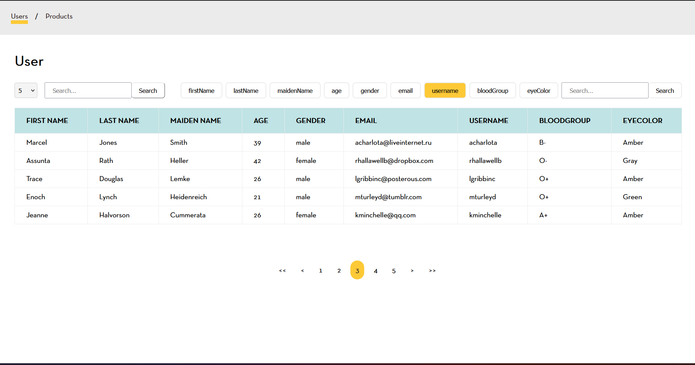

# Mini-Market project for showing users and products

This is the mini-market project showcasing users and products with different features and functionalities.

## Installation

1. Clone the repository:

```bash
git clone https://github.com/Kyaw-Bo-Bo-Aung/mini-market
```

2. Navigate to the project directory:
```bash
cd mini-market
```  

3. npm install
```bash
npm install
``` 

4. Run the project
```bash
npm run start
```

## Usage

#### Features

- Displays a list of users.
- Filter and search users and products according to the provided criteria.

<div style="display: flex;">
    
</div>
